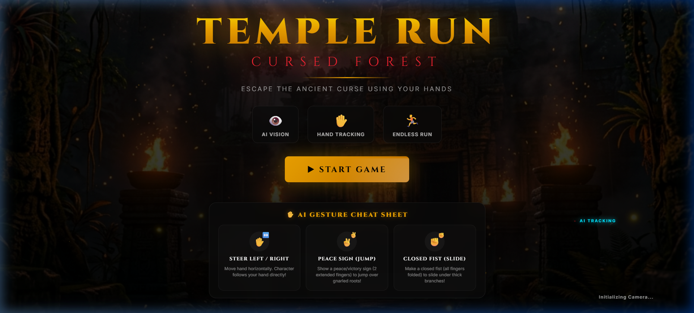

<div align="center">
  

  # ⚡ TEMPEST ⚡
  ### Gesture-Controlled 3D Challenge
  **SATTVA '27 · TECHNICALS**

</div>

---

## 🎮 Event Overview

**TEMPEST** is an exhilarating, real-time gesture-controlled 3D endless runner challenge built with **MediaPipe Hands** and **Three.js WebGL**. Players control an ancient adventurer through dark stone ruins using only their real-world hand gestures captured via webcam (with full keyboard fallback support).

---

## 🕹️ Control Systems & Gestures

Participants stand in front of the camera and use intuitive gestures:

| Gesture | Action | Mechanics |
| :--- | :--- | :--- |
| **Hand Left** ($X < 0.35$) | **Steer Left** | Character smoothly glides to the left lane |
| **Hand Right** ($X > 0.65$) | **Steer Right** | Character smoothly glides to the right lane |
| **Peace Sign (✌️)** | **High Jump** | Index & middle fingers extended to vault over gnarled roots |
| **Closed Fist (✊)** | **Under Slide** | Closed fist folds character down to slide under branches |
| **Hand Visible** | **Sprint** | Maintains running speed |
| **Keyboard Alternative** | **Full Fallback** | <kbd>A</kbd>/<kbd>D</kbd> or <kbd>⬅️</kbd>/<kbd>➡️</kbd> Steer &bull; <kbd>W</kbd>/<kbd>⬆️</kbd>/<kbd>Space</kbd> Jump &bull; <kbd>S</kbd>/<kbd>⬇️</kbd> Slide |

---

## 🏆 Local Leaderboard System

Designed specifically for college festival stalls and gaming booths:
* **Instant High Scores**: Automatically tracks and saves the Top 10 challengers locally in browser `localStorage`.
* **Zero Backend Dependency**: Completely autonomous, offline-capable, with zero server overhead or logins.
* **Next Player Workflow**: A one-click `[ NEXT PLAYER ]` button clears state and prepares the arena immediately for the next queued participant.

---

## 🚀 Running the Festival Stall Locally

```bash
# 1. Install dependencies (if not already done)
npm install

# 2. Start the local server
npm start
```

Navigate to `http://localhost:3000` in Google Chrome or Microsoft Edge.
Grant webcam permissions when prompted!

---

## 🏛️ SATTVA '27 · TECHNICALS
Designed and curated for high-energy student festival challenges.
